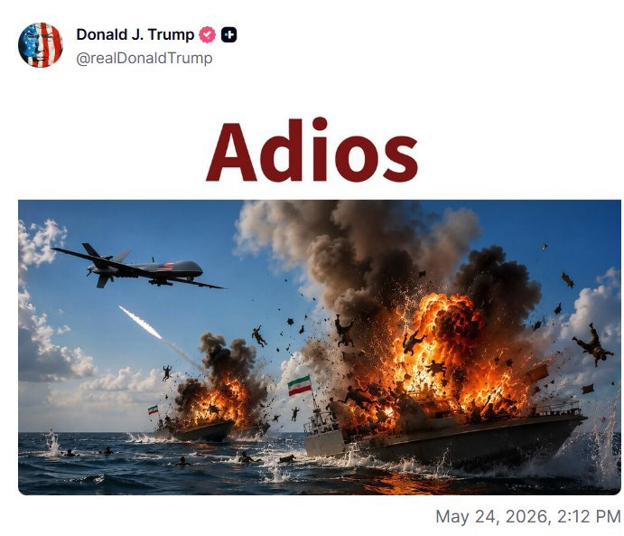
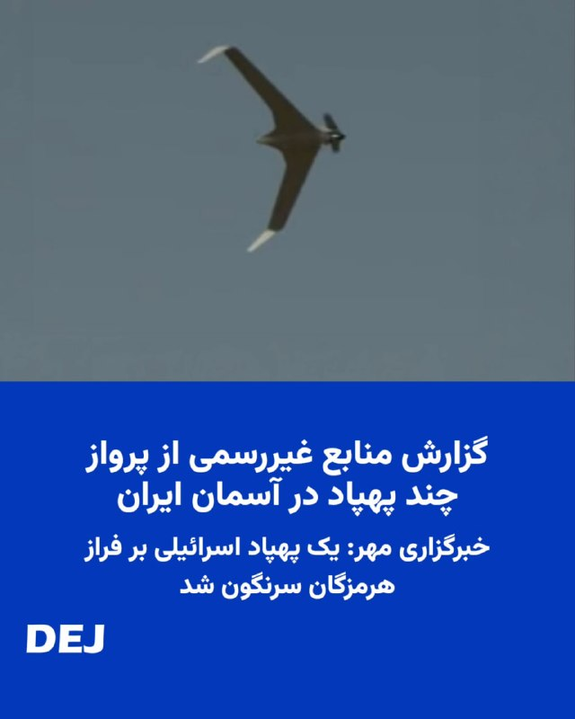
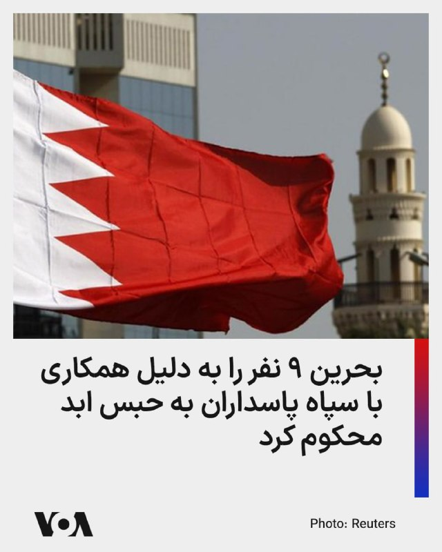

# خواننده تلگرام

<!-- TOP_NAV START -->

<!-- TOP_NAV END -->

<!-- MSG START -->

---
📅 بروزرسانی: 1405/03/03 16:11
---

## iran_action — post 26

🔥#یازدهم_فیزیک_یحیوی1404

🚨جلسه25

## iran_action — post 25

🔥#یازدهم_فیزیک_یحیوی1404

🚨جلسه24

## iran_action — post 24

🔥#یازدهم_فیزیک_یحیوی1404

🚨جلسه23

## iran_action — post 23

🔥#یازدهم_فیزیک_یحیوی1404

🚨جلسه22

## iran_action — post 22

🔥#یازدهم_فیزیک_یحیوی1404

🚨جلسه21

## iran_action — post 21

🔥#یازدهم_فیزیک_یحیوی1404

🚨جلسه20

## iran_action — post 20

🔥#فیزیک_یازدهم_یحیوی_سالیانه_1404

🚨جلسه19

## iran_action — post 19

🔥#یازدهم_فیزیک_یحیوی1404

🚨جلسه 18

## iran_action — post 18

🔥#یازدهم_فیزیک_یحیوی1404

🚨جلسه 17

## iran_action — post 17

🔥#یازدهم_فیزیک_یحیوی1404

🚨جلسه 16

## iran_action — post 16

🔥#یازدهم_فیزیک_یحیوی1404

🚨جلسه 15

## iran_action — post 15

🔥#یازدهم_فیزیک_یحیوی1404

🚨جلسه 14

## iran_action — post 14

🔥#یازدهم_فیزیک_یحیوی1404

🚨جلسه13

## iran_action — post 13

🔥#یازدهم_فیزیک_یحیوی1404

🚨جلسه 12

## iran_action — post 12

🔥#یازدهم_فیزیک_یحیوی1404

🚨جلسه 11

## iran_action — post 11

🔥#یازدهم_فیزیک_یحیوی1404

🚨جلسه 10

## iran_action — post 10

🔥#یازدهم_فیزیک_یحیوی1404

🚨جلسه 09

## iran_action — post 9

🔥#یازدهم_فیزیک_یحیوی1404

🚨جلسه 08

## iran_action — post 8

🔥#یازدهم_فیزیک_یحیوی1404

🚨جلسه 07

## iran_action — post 7

  <a href="telegram/content/iran_action_7_1779626493.webm" target="_blank">🎬 Download video</a>

🔥#یازدهم_فیزیک_یحیوی1404

🚨جلسه 06

## WithYashar — post 12330

  <a href="telegram/content/WithYashar_12330_1779626494.mp4" target="_blank">🎬 Download video</a>

مارکو روبیو: ما توانستیم وارد ونزوئلا شویم و اورانیوم بسیار غنی‌شده را خارج کنیم.
نظام ایران حتی از بحث درباره آن خودداری کرده است. این باید تغییر کند.
@withyashar

## WithYashar — post 12329

روزنامه پاکستانی«داون»: فضای مذاکرات همچنان محتاطانه است؛ تهران حاضر به مصالحه بر حقوق خود نیست
@withyashar

## WithYashar — post 12328

  

پست جدید ترامپ که به اسپانیایی واژه خداحافظ را نوشته که بسیار طعنه آمیز است و معنیه «بری دیگه برنگردی» را میدهد.
@withyashar

## mwarmonitor — post 9635

🔸محمد مرندی عضو تیم مذاکره کننده ایران:

🔹رژیم صهیونیستی «آزادی عمل» نخواهد داشت.

🔹مدیریت تنگه هرمز موضوعی است که میان ایران و عمان، به‌عنوان کشورهای ساحلی، هماهنگ می‌شود.

🔹ایران تحت این یادداشت تفاهم هیچ تعهد هسته‌ای جدیدی نمی‌پذیرد، جز در خصوص سلاح هسته‌ای که موضوع تازه‌ای نیست.

🔹ایران به دارایی‌های مسدودشده خود دسترسی خواهد داشت.

🔹تحریم‌های مرتبط با بخش انرژی لغو خواهند شد.

@mwarmonitor

## mwarmonitor — post 9634

  

ترامپ در سوشال تروث

@mwarmonitor

## mwarmonitor — post 9633

🔸به گفته تایوان، یک کشتی گارد ساحلی چین پس از یک رویارویی پرتنش و تبادل هشدارهای لفظی میان دو گارد ساحلی، آب‌های اطراف جزایر پراتاسِ تایوان را ترک کرده است — رویترز.

@mwarmonitor

## mwarmonitor — post 9632

🔴پلیس ضدشورش ترکیه با شلیک گاز اشک‌آور وارد مقر اصلی حزب اپوزیسیون جمهوری‌خواه خلق (CHP) در آنکارا شد و پس از آنکه دادگاه کنگره حزبی سال ۲۰۲۳ را که در آن اوزگور اوزل انتخاب شده بود باطل کرد و کمال قلیچداراوغلو، رئیس پیشین حزب، را به سمت خود بازگرداند، رهبری برکنار‌شده حزب را از ساختمان بیرون کرد — رویترز

@mwarmonitor

## FoxNewsTwitter — post 342183

  

Fox News (Twitter/X)

Anti-Israel agitators. Climate activists. Communist groups.

Experts warn a growing activist network united by anti-American sentiment — and in some cases China-linked funding networks — is now targeting America’s AI infrastructure and industrial power.

Fox News Digital found many of the same movements protesting side-by-side across the country, including groups opposing new AI data centers over energy and environmental concerns.

“What all of these protests have in common ... is that anti-American trend within them,” Hudson Institute fellow Zineb Riboua told Fox News Digital.

## pm_afshaa — post 91382

  <a href="telegram/content/pm_afshaa_91382_1779626497.webm" target="_blank">🎬 Download video</a>

🔴کانال 14 اسرائیل:
اسرائیل رهبر 86 ساله که از سرطان مرحله 4 در حال مرگ بود رو از بین نبرد تا آمریکا با پسر 56 ساله سالم‌تر و تندروتر او صلح کنه.
با آمریکا یا بدون آمریکا، اسرائیل این رژیم رو به پایان خواهد رسوند.

💧 Rainbet.com the #1 Non-KYC Crypto Casino & Sportsbook @rainbetcom

😁 @Pm_Afshaa

## pm_afshaa — post 91381

  <a href="telegram/content/pm_afshaa_91381_1779626498.webm" target="_blank">🎬 Download video</a>

🔴تسنیم به نقل از منبع آگاه:
آمریکایی‌ها درحال کارشکنی هستن و مسئله پول‌های بلوکه شده باعث شده فعلا توافقی نهایی نشه.

💧 Rainbet.com the #1 Non-KYC Crypto Casino & Sportsbook @rainbetcom

😁 @Pm_Afshaa

## pm_afshaa — post 91380

#مهم عزیزای دلم همگی الان چنل زاپاس‌مون رو جوین بشید کانال تحت ریپورت شدیده اگه چیزی شد زاپاس رو داشته باشید فعالیت میاد اونور
👇 https://t.me/Pm_Zapas https://t.me/Pm_Zapas

## DEJradio — post 4917

  

🔸
🛩️ منابع غیررسمی یکشنبه سوم خرداد ۱۴۰۵ از پرواز چند پهپاد بر فراز ایران خبر دادند. شهروندان در استان‌های غربی و جنوبی پرواز این پهپادها را گزارش دادند. نوع این پهپادها هنوز مشخص نیست اما شنیده شد یکی از آنها «اوربیتر» است.
خبرگزاری مهر، وابسته به سازمان تبلیغات اسلامی، اعلام کرد یک پهپاد اسرائیلی که کاربری جاسوسی و شناسایی داشت، با شلیک پدافند ارتش جمهوری اسلامی سرنگون شد. این گزارش افزود: «لاشه پهپاد متلاشی شده اربیتر با همکاری ناوگروه دریابانی فراجای هرمزگان کشف شد.»

#پهپاد
@DEJradio

## DEJradio — post 4916

🎤
⭕️ برنامه چالش
گفتگو با ناصر کرمی اقلیم شناس و عضو جبهه هفت آبان؛
غیبت مجتبی خامنه‌ای؛ چه کسانی تصمیم‌گیر هستند؟

#چالش #موشتبا
@DEJradio

## DEJradio — post 4915

👑🎥 روز شنبه ۲۳ می در برلین، بار دیگر خیابان‌ها شاهد حضور ایرانیان آزادی‌خواه بود؛ تجمعی در مسیر کاخ صدراعظمی آلمان که با هدف رساندن صدای مردم ایران به گوش جهان برگزار شد. ایمان صفتی گزارش می‌دهد

#گزارش #همبستگی
@DEJradio

## DEJradio — post 4914

  

🔸
⭕️ خبرگزاری تسنیم، وابسته به سـ.ـپاه پاسداران گزارش داد اختلاف میان جمهوری اسلامی و آمریکا بر سر یکی دو بند از تفاهم‌نامه احتمالی همچنان ادامه دارد و به دلیل «مانع‌تراشی‌های آمریکا» هنوز موضوع نهایی نشده است.
همچنین رویترز به نقل از یک «منبع ارشد ایرانی» نوشت که تهران با تحویل ذخیره اورانیوم بسیار غنی شده خود موافقت نکرده و مسئله هسته‌ای بخشی از توافق اولیه نیست.

#مذاکرات #برنامه_اتمی
@DEJradio

## DEJradio — post 4913

  <a href="telegram/content/DEJradio_4913_1779626499.mp4" target="_blank">🎬 Download video</a>

🔸🎥 پاکستان؛ بیش از ۱۲۰ کشته و زخمی در حمله انتحاری به یک قطار

کشوری که در تامین امنیت داخلی خود سر تا پا مشکل دارد و با انواع بحران روبروست، میانجی مذاکره آمریکا و جمهوری اسلامی شده است.

#پاکستان
@DEJradio

## kianmeli1 — post 87629

  

🔴پست جدید ترامپ درحالی که خبرها از احتمال اعلام تفاهم پایان جنگ در آینده نزدیک است
https://t.me/kianmeli1

## IranIntlTV — post 338760

  

نیروی دریایی سپاه پاسداران اعلام کرد در شبانه‌روز گذشته، ۳۳ کشتی اعم از نفتکش، کانتینربر و سایر کشتی‌های تجاری «پس از کسب مجوز و با هماهنگی و تامین امنیت این نیرو« از تنگه هرمز عبور کردند.
روز شنبه نیز سپاه پاسداران از عبور ۲۵ کشتی از تنگه هرمز خبر داده بود.
https://iranintl.com/202605246781

## IranIntlTV — post 338759

  <a href="telegram/content/IranIntlTV_338759_1779626502.mp4" target="_blank">🎬 Download video</a>

یکی از بستگان جاویدنام علی مشهدی در تجمع استکهلم، در گفت‌وگو با مهران عباسیان، خبرنگار ایران‌اینترنشنال، درباره نحوه کشته شدن او توضیح داد و پیام پدر این جاویدنام را به اشتراک گذاشت.
@iranintltv

## IranIntlTV — post 338758

فایننشال‌تایمز: جنگ ایران، شکاف میان مصر و امارات متحده عربی را آشکار کرد

فایننشال‌تایمز گزارش داد مصر در اقدامی کم‌سابقه جنگنده‌هایی را به امارات متحده عربی اعزام کرده؛ حرکتی که به نوشته این روزنامه، نشانه تلاش قاهره برای کاهش تنش با ابوظبی و پاسخ به نارضایتی امارات از حمایت ناکافی متحدان عرب در برابر حملات جمهوری اسلامی است.

بر اساس این گزارش، افشای این استقرار نظامی زمانی رخ داد که عبدالفتاح السیسی، رییس‌جمهوری مصر، در سفر اخیر خود به امارات در کنار محمد بن زاید آل نهیان از جنگنده‌های «رافال» مصری مستقر در این کشور بازدید کرد. سیسی در این دیدار گفت: «هر آنچه به امارات آسیب بزند، به مصر آسیب زده است.»

فایننشال‌تایمز نوشت قاهره جزئیاتی از این ماموریت نظامی منتشر نکرده، اما اعزام نیرو ظاهرا با هدف کاهش تنش‌ها با امارات متحده عربی صورت گرفته؛ کشوری که پیش‌تر از دولت‌های عربی به دلیل کمک نکردن کافی در دفاع مقابل حملات حکومت ایران انتقاد کرده بود.

امارات متحده عربی که هدف اصلی حملات تلافی‌جویانه جمهوری اسلامی در جریان جنگ بوده، طی سال‌های اخیر نقش حیاتی در حمایت اقتصادی از مصر ایفا کرده است. این کشور در سال ۲۰۲۳ با یک سرمایه‌گذاری ۳۵ میلیارد دلاری، به تثبیت اقتصاد بحران‌زده مصر کمک کرد و همچنین حواله‌های مالی صدها هزار مصری شاغل در امارات متحده عربی، منبع مهم ارز خارجی برای قاهره محسوب می‌شود.

به نوشته فایننشال‌تایمز، در ابوظبی این برداشت شکل گرفته که جنگ اخیر نشان داد کدام متحدان در شرایط بحرانی قابل اتکا هستند. انور قرقاش، مشاور دیپلماتیک رییس امارات متحده عربی، در ماه مارس از کشورهایی که در برابر «تجاوز ایران» واکنش کافی نشان ندادند انتقاد کرده بود.

این روزنامه همچنین نوشت جنگ اخیر، شکاف‌های تازه‌ای در میان کشورهای منطقه ایجاد کرده و ائتلاف‌های خاورمیانه را در حال بازتعریف قرار داده است. به باور برخی تحلیلگران، محور جدیدی میان عربستان سعودی، مصر، ترکیه و پاکستان در حال شکل‌گیری است؛ کشورهایی که نسبت به نقش اسرائیل در بی‌ثباتی منطقه نگرانی دارند و برای پایان دادن به جنگ آمریکا و اسرائیل علیه حکومت ایران تلاش‌های دیپلماتیک انجام داده‌اند.

اما امارات متحده عربی نسبت به این روند بدبین بوده و نگران است هرگونه توافق، جمهوری اسلامی را در موقعیتی قوی‌تر حفظ کند. مایکل وحید حنا، تحلیلگر گروه بین‌المللی بحران، به فایننشال‌تایمز گفت از نگاه ابوظبی، مشارکت مصر در میانجی‌گری ممکن است به معنای ایجاد نوعی هم‌ترازی سیاسی میان جمهوری اسلامی ایران و امارات متحده عربی تلقی شده باشد؛ موضوعی که برای امارات قابل پذیرش نیست. به گفته او، امارات احساس کرده میانجی‌ها حمایت کافی از مواضع این کشور نشان نداده‌اند.

فایننشال‌تایمز همچنین گزارش داد مصر به دقت رفتار امارات متحده عربی با پاکستان را دنبال کرده است. ابوظبی در ماه آوریل از اسلام‌آباد خواست بازپرداخت فوری وام ۳.۵ میلیارد دلاری را انجام دهد؛ اقدامی که برخی آن را ناشی از نارضایتی امارات از نقش پاکستان در میانجی‌گری میان حکومت ایران و آمریکا دانستند.

به نوشته این روزنامه، اعزام جنگنده‌های مصری تا حدی تنش‌ها میان قاهره و ابوظبی را کاهش داده است. عبدالخالق عبدالله، پژوهشگر اماراتی، این اقدام را «غافلگیری خوشایند» توصیف کرد و گفت: «ما تصور می‌کردیم مصر مردد است و کمک چندانی نمی‌کند. اکنون با ایرانی بسیار تهاجمی روبه‌رو هستیم و این اقدام می‌تواند پیام مهمی برای تهران داشته باشد.»

در عین حال، نزدیکی بیشتر امارات متحده عربی به اسرائیل پس از حملات جمهوری اسلامی ایران، واکنش منفی بخشی از افکار عمومی مصر را برانگیخته است. کاربران مصری شبکه‌های اجتماعی بارها از روابط امارات و اسرائیل انتقاد کرده‌اند؛ موضوعی که به نوشته فایننشال تایمز، در ابوظبی با نارضایتی دنبال شده است.

این گزارش همچنین به اختلاف‌های دیرینه دو کشور درباره مسائل منطقه‌ای اشاره می‌کند؛ از جمله جنگ داخلی سودان، که مصر از ارتش سودان و امارات متحده عربی متهم به حمایت از نیروهای رقیب است، و نیز روابط نزدیک ابوظبی با اتیوپی بر سر پروژه سد بزرگ نیل؛ موضوعی که قاهره آن را تهدیدی برای امنیت آبی خود می‌داند.

فایننشال‌تایمز نوشت اگرچه مصر و امارات همچنان متحد باقی مانده‌اند، اما جنگ ایران شکاف‌های پنهان میان دو کشور را آشکار کرده و نشان داده است که فشارهای امنیتی منطقه‌ای می‌تواند اتحادهای سنتی جهان عرب را بازتعریف کند.

🔗وب‌سایت ایران‌اینترنشنال
@iranintltv

## IranIntlTV — post 338757

  <a href="telegram/content/IranIntlTV_338757_1779626504.mp4" target="_blank">🎬 Download video</a>

یک شهروند با ارسال پیامی به ایران‌اینترنشنال می‌گوید: «ترامپ اشتباه کردی. اشتباه می‌کنی. اشتباه پشت اشتباه. با این‌ها به توافق نمی‌رسی. نه تنها به آنها وقت می‌دهی بلکه قویترشان می‌کنی، ظالم‌ترشان می‌کنی.»

## IranIntlTV — post 338756

  

مهدی کوهیان، مدیر حقوقی خانه سینما، تایید کرد شماری از سینماگران به دادسرای فرهنگ و رسانه احضار شده‌اند و در برخی احضاریه‌ها، اتهام «همکاری با دولت متخاصم» مطرح شده است.

کوهیان در گفت‌وگو با ایسنا گفت این احضارها به هومن سیدی و سعید روستایی محدود نیست و تعدادی دیگر از هنرمندان نیز با چنین پرونده‌هایی مواجه شده‌اند.

او به سنگینی این اتهام اشاره کرد و گفت طرح عنوان «همکاری با دولت متخاصم» علیه هنرمندان می‌تواند به «تعمیق شکاف اجتماعی» و آسیب به «انسجام داخلی» منجر شود.

کوهیان همچنین گفت استفاده از چنین اتهام سنگینی برای «کوچک‌ترین فعالیت حرفه‌ای»، مصاحبه، نقدهای درون‌گفتمانی یا حتی «لغزشی نابخردانه»، ارزش و اعتبار آن را در سطح ملی و بین‌المللی کاهش می‌دهد و به ضرر «امنیت واقعی کشور» است.
https://iranintl.com/202605244549

## IranIntlTV — post 338755

  <a href="telegram/content/IranIntlTV_338755_1779626507.mp4" target="_blank">🎬 Download video</a>

بر اساس ویدیوهای رسیده به ایران‌اینترنشنال، گروهی از بازنشستگان در شوش یکشنبه سوم خرداد تجمع کرده و شعار دادند: «تا حق خود نگیریم، از پا نمی‌نشینیم»

## IranIntlTV — post 338754

  

محمدرضا عارف، معاون اول پزشکیان گفت: «مدیران دولت تا زمانی که مباحث کارشناسی درباره مدیریت مصرف بنزین نهایی نشده است، حق اظهارنظر شخصی ندارند.»

او افزود: «اگر کسی از این دستور تخطی کند با او برخورد می‌شود، زیرا ابتدا باید نظرات کارشناسی بررسی و سپس جمع‌بندی نهایی حاصل شود.»

او ادامه داد: «مسئولان تا پیش از آن حق ندارند اظهارنظر شخصی کنند، چرا که نباید در جامعه التهاب یا نگرانی ایجاد شود.»
iranintl.com/202605243568

## FarsiVOA — post 218518

  

محمدرضا عارف، معاون اول رئیس‌جمهور به مدیران دولتی دستور داد تا پیش از نهایی شدن بررسی‌های کارشناسی درباره مدیریت مصرف بنزین، هیچ مسئولی حق اظهارنظر شخصی در این زمینه ندارد.

او هشدار داد در صورت تخطی از این دستور، با فرد خاطی برخورد خواهد شد؛ زیرا به گفته او، اظهارنظرهای زودهنگام می‌تواند در جامعه التهاب و نگرانی ایجاد کند.

این دستور در شرایطی صادر شده که شایعات درباره افزایش قیمت بنزین، تغییر سهمیه‌ها و تشدید سیاست‌های مدیریت مصرف بالا گرفته است.

همزمان، ناترازی بنزین و فاصله میان مصرف داخلی و توان تأمین سوخت، نگرانی‌ها درباره کمبود احتمالی یا فشار بیشتر بر شبکه توزیع را افزایش داده است.

عارف گفت دولت تلاش می‌کند تصمیم‌ها به‌گونه‌ای اتخاذ شود که معیشت مردم آسیب نبیند، اما واقعیات اقتصادی کشور و تحولات اخیر نیز باید در نظر گرفته شود.
@FarsiVOA

## FarsiVOA — post 218517

  

خبرگزاری رسمی بحرین گزارش داد که یک دادگاه این کشور، ۹ متهم را به حبس ابد و دو نفر دیگر را به سه سال زندان محکوم کرده است. بر اساس این گزارش، این افراد به همکاری با سپاه پاسداران برای انجام «اقدامات خصمانه و تروریستی» علیه بحرین متهم بودند.

در بیانیه‌ای که روز یکشنبه منتشر شد، آمده است که متهمان در جمع‌آوری اطلاعات درباره مکان‌های حساس و تسهیل انتقال‌های مالی مرتبط نقش داشته‌اند.

پیشتر وزارت کشور بحرین اعلام کرد که ۴۱ نفر را که با سپاه پاسداران مرتبط بوده‌اند، بازداشت کرده است.

این وزارتخانه ۱۹ اردیبهشت در بیانیه‌ای که در شبکه‌های اجتماعی منتشر شد، نوشت که این افراد اعضای هسته اصلی «یک سازمان مرتبط با سپاه پاسداران» و مدافع تئوری «ولایت فقیه» بوده‌اند.
@FarsiVOA

## FarsiVOA — post 218516

  

مقام‌های ترکیه به پلیس این کشور دستور دادند اوزگور اوزل، رهبر حزب جمهوری‌خواه خلق، حزب اصلی اپوزیسیون را از مقر این حزب اخراج کند.

به گزارش رویترز، فرمانداری آنکارا روز یکشنبه این دستور را برای برکناری اعضای حزب جمهوری‌خواه خلق که با اوزگور اوزل، رهبر برکنار‌شده، همسو هستند صادر کرد و پلیس ضد شورش و گروهی از افراد در برابر درهای مقر حزب جمهوری‌خواه خلق در پایتخت ترکیه تجمع کردند.

یک دادگاه تجدیدنظر ترکیه روز پنج‌شنبه نتایج کنگره حزب جمهوری‌خواه خلق در سال ۲۰۲۳ را که اوزل در آن به عنوان رهبر انتخاب شده بود، به دلیل «تخلفات نامشخص» باطل کرد.

این دادگاه به جای اوزل، کمال قلیچداراوغلو، رئیس پیشین حزب جمهوری‌خواه خلق را که در انتخابات همان سال از رئیس‌جمهور طیب اردوغان شکست خورد، دوباره به این سمت بازگرداند.

اوزل روز شنبه خواست هرچه سریع‌تر کنگره جدیدی برای حزب برگزار شود، اما قلیچداراوغلو گفت کنگره در «زمانی مناسب» برگزار خواهد شد.
@FarsiVOA

## FarsiVOA — post 218515

  

تایمز اسرائیل به نقل از یک مقام ارشد اسرائیلی گزارش داد دونالد ترامپ، رئیس‌جمهور ایالات متحده آمریکا، در تماس تلفنی با بنیامین نتانیاهو به او اطمینان داده که توافق نهایی با جمهوری اسلامی، برنامه هسته‌ای تهران را به‌طور کامل برمی‌چیند و همه اورانیوم غنی‌شده از قلمرو جمهوری اسلامی خارج خواهد شد.

بر اساس این گزارش، ترامپ تأکید کرده در مذاکرات بر خواسته دیرینه خود برای برچیدن برنامه هسته‌ای جمهوری اسلامی و خارج شدن تمام ذخایر اورانیوم غنی‌شده پافشاری خواهد کرد و بدون تحقق این شروط، توافق نهایی را امضا نمی‌کند.

این مقام اسرائیلی همچنین گفته واشنگتن، اسرائیل را در جریان مذاکرات بر سر تفاهم‌نامه‌ای برای بازگشایی تنگه هرمز و ورود به گفت‌وگوهای نهایی درباره موارد اختلافی قرار داده است.

نتانیاهو نیز در این تماس گفته اسرائیل آزادی عمل خود را در برابر تهدیدها در همه جبهه‌ها حفظ خواهد کرد؛ موضعی که به گفته این مقام، با حمایت دوباره ترامپ همراه شده است.
@FarsiVOA

## FarsiVOA — post 218514

  

اورزولا فون‌درلاین، رئیس کمیسیون اروپا، از بروز نشانه‌های پیشرفت در مذاکرات بر سر توافق احتمالی میان ایالات متحده و جمهوری اسلامی استقبال کرد.

فون‌درلاین یکشنبه در شبکه ایکس نوشت: «من از پیشرفت به سوی توافقی میان آمریکا و [حکومت] ایران استقبال می‌کنم. ما به توافقی نیاز داریم که واقعاً به کاهش تنش‌ها منجر شود، تنگه هرمز را دوباره باز کند و آزادی کامل کشتیرانی بدون پرداخت عوارض را تضمین کند.»

او همچنین تأکید کرد: «نباید به ایران اجازه داده شود که سلاح هسته‌ای توسعه دهد.»

دونالد ترامپ، رئیس‌جمهوری آمریکا، پیش‌تر گفته است که واشنگتن و جمهوری اسلامی «تا حد زیادی» بر سر یک یادداشت تفاهم مذاکره کرده‌اند.
@FarsiVOA

## DW_Farsi — post 125093

🔶 حمله گسترده روسیه به کی‌یف با چندین کشته و ده‌ها زخمی

طبق اعلام مقام‌های اوکراینی در روز یکشنبه ۲۴ مه (سوم خرداد)، در پی حملات گسترده جدید روسیه با پهپادهای رزمی و موشک‌های بالستیک و کروز به کی‌یف، پایتخت اوکراین، و مناطق اطراف آن، دست‌کم چهار نفر کشته شده‌اند.

همچنین بیم آن می‌رود که شمار قربانیان افزایش یابد. تصاویر ویدئویی منتشرشده از شهر، ویرانی‌های گسترده‌ای را نشان می‌دهند.
ویتالی کلیچکو، شهردار کی‌یف، در تلگرام اعلام کرد که در جریان حملات شامگاه گذشته، دست‌کم دو نفر در خود پایتخت کشته شده‌اند. دست‌کم ۵۶ نفر نیز زخمی شده‌اند.

به گفته کلیچکو، ۳۰ نفر، از جمله دو کودک، در بیمارستان بستری شده‌اند. نیروهای امدادی مشغول آواربرداری از ساختمان‌های مسکونی‌ای هستند که در جریان حمله هدف قرار گرفته‌اند.

میکولا کالاشنیک، رئیس اداره منطقه‌ای کی‌یف، نیز اعلام کرده است که در مناطق اطراف پایتخت دست‌کم دو نفر کشته و ۹ نفر زخمی شده‌اند.

بر اساس اعلام نیروی هوایی اوکراین، روسیه در این حمله از ۹۰ موشک بالستیک و کروز و نیز ۶۰۰ پهپاد از انواع مختلف استفاده کرده است.

سامانه پدافند هوایی اوکراین اعلام کرد که در مجموع ۶۰۴ هدف، از جمله ۵۵ موشک بالستیک و کروز و ۵۴۹ پهپاد، ردیابی و منهدم شده‌اند. با این حال، اصابت ده‌ها پرتابه روسی به اهدافی در این منطقه ثبت شده است.

ولودیمیر زلنسکی، رئیس جمهور اوکراین، اعلام کرد که مسکو بار دیگر از موشک میان‌بُرد اورشنیک استفاده کرده، اما این نخستین بار بوده که چنین موشکی در نزدیکی منطقه کی‌یف به کار گرفته شده است.

زلنسکی در پیام ویدئویی منتشرشده‌اش در بامداد امروز یکشنبه در کی‌یف گفت ولادیمیر پوتین، رئیس کرملین، این موشک را به سمت شهر "بیلا تسرکوا"، واقع در استان کی‌یف، شلیک کرده است. او درباره میزان خسارت‌ها در این منطقه توضیحی نداد.

خبرگزاری دولتی "اینترفکس" روسیه، با استناد به اطلاعات وزارت دفاع این کشور، استفاده از موشک اورشنیک را تأیید کرده است.

بر این اساس، اوکراین با چهار نوع موشک مختلف اورشنیک، اسکندر، کینژال و زیرکُن هدف قرار گرفته است. این موشک‌ها در دسته موشک‌های موسوم به فراصوت قرار می‌گیرند که سرعتی بسیار بالا دارند.

به گفته روسیه، این حمله پاسخی تلافی‌جویانه به حملات اوکراین به منطقه لوهانسک بوده است. طبق اعلام روسیه، در جریان حمله به منطقه تحت اشغال این کشور در لوهانسک، یک مرکز آموزش عالی فنی و خوابگاه دانشجویی‌اش در شهر استاروبیلسک هدف قرار گرفته و ۲۱ نفر کشته شده‌اند.

کی‌یف هدف قرار دادن عمدی غیرنظامیان را رد کرده و اعلام کرده است که هدف، یک واحد پهپادی ارتش روسیه در آن منطقه بوده است.
موشک اورشنیک (به معنی "درختچه فندق") با قدرت تخریبی شدیدش شناخته می‌شود. این موشک که مسکو آن را در بلاروس نیز مستقر کرده است، هم توان حمل کلاهک‌های متعارف و هم هسته‌ای را دارد.

سرعت بسیار بالای اورشنیک که تا ۱۲ هزار کیلومتر در ساعت با بردی تا پنج هزار کیلومتر تخمین زده می‌شود، آن را به تهدیدی بالقوه برای سراسر قاره اروپا تبدیل می‌کند.

زلنسکی گفت: «این واقعاً اقدامی غیرمسئولانه است. مهم است که این اقدام برای روسیه بی‌پیامد نماند.» طبق گزارش‌ها، این سومین بار است که این سلاح در جنگ روسیه علیه اوکراین به کار گرفته می‌شود.

مناطق اطراف کی‌یف و دیگر بخش‌های کشور نیز هدف این حملات قرار گرفته‌اند. با این حال، زلنسکی گفت: «بیشترین اصابت‌ها در کی‌یف رخ داد و دقیقاً کی‌یف هدف اصلی این حمله روسیه بود. سه موشک روسی به یک تأسیسات آب‌رسانی اصابت کرد، یک بازار در آتش سوخت و ده‌ها ساختمان مسکونی و چندین مدرسه عادی آسیب دیدند.»

سازمان دفاع غیرنظامی اوکراین تصاویر و ویدیوهایی از تخریب‌های گسترده زیرساخت‌های غیرنظامی و آتش‌سوزی‌های بزرگ منتشر کرده که نیروهای امدادی را در حال مهار آنها نشان می‌دهد.

در تمام طول شب گذشته و صبح امروز یکشنبه، در منطقه کی‌یف هشدارهای حمله هوایی داده شده و گزارش‌هایی از انفجار در نقاط مختلف پایتخت منتشر شده است.

دفتر مرکزی کانال اول تلویزیون آلمان (ARD) نیز که در مرکز کی‌یف قرار دارد به‌شدت آسیب دیده و بخشی از آن تخریب شده است.
این تخریب احتمالاً بر اثر موج انفجار رخ داده و باعث شکسته شدن پنجره‌ها، ویرانی اتاق‌ها و فروریختن دیوارها شده است. هنگام وقوع این حادثه هیچ‌یک از کارکنان این شبکه در دفتر حضور نداشته‌اند.

با وجود خسارت‌های سنگین، پوشش خبری این شبکه از اوکراین ادامه خواهد یافت و تولید برنامه‌ها و گزارش‌های زنده با استفاده از راهکارهای فنی سیار و امکانات جایگزین ادامه خواهد داشت.
@dw_farsi

## DW_Farsi — post 125092

📸 تحریم‌ها، محرومیت‌ها و غیاب‌ها در جام‌های جهانی فوتبال در گذر زمان

🔺 گزارشی از شهرام احدی

اگر چه تیم ملی فوتبال ایران بلیط حضور در جام جهانی ۲۰۲۶ را گرفته، اما گمانه‌زنی‌ها در مورد غیاب یا حضور ایران پایان نیافته است. در تاریخ جام جهانی فوتبال کشورهای مختلفی به علت تحریم، محرومیت یا علل دیگر غایب بوده‌اند.

@dw_farsi

## DW_Farsi — post 125091

  

🔶 "ترامپ به نتانیاهو گفته توافق نهایی با ایران شامل لغو برنامه هسته‌ای و خروج اورانیوم می‌شود"

برخی رسانه‌های اسرائیل به نقل از یک مقام ارشد این کشور گزارش داده‌اند که دونالد ترامپ، رئیس جمهور آمریکا در تماس تلفنی شامگاه شنبه با بنیامین نتانیاهو، به او اطمینان داده که توافق نهایی با ایران منجر به برچیده‌ شدن کامل برنامه هسته‌ای ایران خواهد شد.

روزنامه "تایمز اسرائیل" نوشت این مقام که نامش فاش نشده در بیانیه‌ای اظهار داشت، ترامپ در این گفت‌وگو "واضح ساخت که در مذاکرات [با تهران] بر خواسته دیرینه خود مبنی بر برچیده‌شدن برنامه هسته‌ای ایران و خروج تمام اورانیوم غنی‌شده از این خاک این کشور قاطعانه پافشاری خواهد کرد و بدون تحقق این شروط، هیچ توافق نهایی را امضا نخواهد کرد".

در این بیانیه آمده است که آمریکا، اسرائیل را در جریان مذاکرات "درباره یک یادداشت تفاهم برای بازگشایی تنگه هرمز و ورود به مذاکرات برای دستیابی به توافق نهایی درباره موارد باقی‌مانده مورد اختلاف" قرار داده است.

به گفته این مقام اسرائیلی نتانیاهو به ترامپ گفته است که اسرائیل "آزادی عمل خود در برابر همه تهدیدها در تمامی جبهه‌ها از جمله لبنان" را حفظ خواهد کرد و رئیس جمهور آمریکا نیز "حمایت خود را از این رویکرد اعلام کرده است".

وبسایت خبری "اکسیوس" پیش‌تر گزارش داده بود که توافق در حال شکل‌گیری میان تهران و واشنگتن تصریح می‌کند که درگیری میان اسرائیل و حزب‌الله لبنان پایان خواهد یافت اما اسرائیل اجازه خواهد داشت تا در صورتی که حزب‌الله آغازگر اقداماتی تحریک‌آمیز یا حملاتی علیه این کشور باشد، این گروه را هدف قرار دهد.

از سوی دیگر خبرگزاری رویترز به نقل از یک مقام ارشد ایرانی گزارش کرده است که تهران در توافق اولیه، با واگذاری اورانیوم غنی‌شده با درصد بالا، مخالفت کرده است.

@dw_farsi

## Persian_Trend_Official — post 14858

  <a href="telegram/content/Persian_Trend_Official_14858_1779626513.webm" target="_blank">🎬 Download video</a>

▪️رئیس‌جمهور ترامپ جوان‌تر می‌شود

منظور ترامپ از این کنایه جوان تر به نظر رسیدن خودش نسبت شی جی پینگ است

🫆:Tony

📌 @persian_trend_official
پرشین ترند | متفاوت‌ترین کانال نظامی

## Persian_Trend_Official — post 14857

‍‌‌‌
🔴عبور ۳۳ کشتی در شبانه‌روز گذشته با مجوز سپاه

💢نیروی دریایی سپاه: طی شبانه روز گذشته ۳۳ فروند کشتی اعم از نفتکش، کانتینربر و سایر کشتی های تجاری پس از کسب مجوز با هماهنگی و تامین امنیت نیروی دریایی سپاه از تنگه هرمز عبور کردند.

🫆:Tony

📌 @persian_trend_official
پرشین ترند | متفاوت‌ترین کانال نظامی

## Persian_Trend_Official — post 14856

  <a href="telegram/content/Persian_Trend_Official_14856_1779626513.webm" target="_blank">🎬 Download video</a>

🔴ترامپ

▪️خدانگهدار

🫆:Tony

📌 @persian_trend_official
پرشین ترند | متفاوت‌ترین کانال نظامی

## Persian_Trend_Official — post 14855

♦️حسام‌الدین آشنا:

💢فیلترینگ سراسری امنیت نمی‌آورد، هزینه می‌آورد

💢برخی از مسئولان و غیرمسئولان گویا به هدف بلند‌مدت خود که بستن اینترنت در ایران بوده به واسطه جنگ رسیده اند و حاضر نیستند دست بردارند / انتخاب

🫆:Tony

📌 @persian_trend_official
پرشین ترند | متفاوت‌ترین کانال نظامی

## RadioFarda — post 157517

  

🔸 خبرگزاری رسمی بحرین روز یک‌شنبه گزارش داد که دادگاهی در این کشور ۹ متهم را به حبس ابد و دو متهم دیگر را به سه سال زندان محکوم کرده است.

🔸 بر اساس این گزارش، این افراد به همکاری با سپاه پاسداران برای انجام آنچه «اقدامات خصمانه و تروریستی» علیه بحرین توصیف شده، متهم شده‌اند.

🔸 در بیانیهٔ منتشرشده آمده است که متهمان در «گردآوری اطلاعات دربارهٔ مراکز حساس و تسهیل انتقال‌های مالی مرتبط با آن» دست داشته‌اند.

🔸 بحرین که از کشورهای دارای اکثریت شیعه‌مذهب است، روابط پرتنشی با جمهوری اسلامی ایران داشته و پایتخت آن در جریان جنگ آمریکا و اسرائیل با ایران هدف حملات موشکی و پهپادی سپاه پاسداران قرار گرفت.

🔸 مقامات دولت بحرین در سال‌های اخیر بارها اعلام کرده‌اند که نیروهای امنیتی آن کشور توانسته‌اند «نقشه‌های شبه‌نظامیان مورد حمایت ایران» را خنثی بکنند.

@RadioFarda

## IranianMinds — post 20664

🔴روزنامه اطلاعات:

غیبت مجتبی خامنه‌ای یک سلاح راهبردی است. دشمن خواهان حضور زودهنگام یک رهبر مجروح است.

@IranianMinds

## IranianMinds — post 20663

  

🔴پست جدید ترامپ.

@IranianMinds

## BBCPersian — post 281952

  

🔻 مارکو روبیو، وزیر خارجه آمریکا، می‌گوید که احتمال دارد در ساعات آینده بیانیه‌ای اعلام شود که رسما به جنگ در خاورمیانه پایان می‌دهد. دونالد ترامپ گفته بود که مذاکرات با ایران به مراحل پایانی رسیده است.

وزیر خارجه آمریکا در کنفرانس خبری در هند بدون اشاره به جزئیات گفت که توافق احتمالی نگرانی‌های ایالات متحده در مورد تنگه هرمز را «تا حد زیادی» برطرف خواهد کرد و اجازه نمی‌دهد که ایران به سلاح هسته‌ای دست پیدا کند.

مقام‌های ایران هنوز در مورد محتوای توافق احتمالی صحبتی نکرده‌اند؛ هرچند مسعود پزشکیان، رئیس‌جمهور ایران، امروز گفت: «هیچ تصمیمی خارج از چارچوب شورای‌عالی امنیت ملی و بدون هماهنگی و اذن مقام معظم رهبری اتخاذ نخواهد شد.»

در همین حال، گزارش‌های غیر‌رسمی‌ و تاییدنشده‌ای از جزئیات توافق احتمالی تهران و واشنگتن منتشر شده است.

بیشتر بخوانید:
https://bbc.in/3PA6wR2
📸Getty Images
@BBCPersian

## alonews — post 122326

  <a href="telegram/content/alonews_122326_1779626516.webm" target="_blank">🎬 Download video</a>

👈تصاویری از لاشه پهپاد جاسوسی اسرائیل در هرمزگان‌

✅ @AloNews خبر جنگ

## alonews — post 122323

  <a href="telegram/content/alonews_122323_1779626516.webm" target="_blank">🎬 Download video</a>

👈ترامپ درباره چین در Truth Social پست می‌گذارد

✅ @AloNews خبر جنگ

## alonews — post 122322

  

🚨فوری و رسمی؛ با اعلام afc استقلال و تراکتور به عنوان نمایندگان ایران در لیگ نخبگان امسال مشخص شدند.

🔴تورنومنت 6 جانبه برگزار نمیشه
🟡سپاهان به لیگ دو آسیا رفت
🔴پرسپولیس سهمیه نگرفت
@AloSport

## alonews — post 122321

  <a href="telegram/content/alonews_122321_1779626517.webm" target="_blank">🎬 Download video</a>

👈رویترز: ایران با تحویل اورانیوم غنی‌شده با غنای بالا موافقت نکرده است

✅ @AloNews خبر جنگ

## alonews — post 122320

  <a href="telegram/content/alonews_122320_1779626517.webm" target="_blank">🎬 Download video</a>

⚫
🏆 به دنیای هیجان‌انگیز فوتبال خوش اومدی!

⭐️اینجا قراره باهم لحظه‌به‌لحظه‌ی جام جهانی رو زندگی کنیم؛
از بازی‌های حساس و نتایج داغ گرفته تا حاشیه‌ها، کری‌خونی‌ها و اتفاقاتی که همه درباره‌ش حرف میزنن! 
🔥
🔥

✅ پوشش کامل مسابقات

💀 ترول تیم‌ها و بازیکن‌ها

🎥 ویدیوها و لحظه‌های فان فوتبالی

📊 آمار، ترکیب‌ها و اخبار فوری

🌍 حواشی جذاب از سراسر جام جهانی

📢اینجا فقط یک کانال خبری نیست؛
یک جمع فوتبالیه برای کسایی که فوتبال رو با هیجان، شوخی و احساس واقعی دنبال میکنن 
📛
💟

🆘
🔞 آماده باش چون قراره جام جهانی رو متفاوت تجربه کنیم!

⚡ @Vaarzesh_Plus

⚡ @Vaarzesh_Plus

## alonews — post 122319

  <a href="telegram/content/alonews_122319_1779626517.webm" target="_blank">🎬 Download video</a>

👈پست جدید ترامپ درباره نیروی دریایی ایران : خداحافظ

✅ @AloNews خبر جنگ

## alonews — post 122318

  <a href="telegram/content/alonews_122318_1779626518.webm" target="_blank">🎬 Download video</a>

👈رند پاول از سناتور های برجسته جمهوری خواه: جنگ همیشه با مذاکره به پایان می‌رسد

🔴منتقدان مذاکرات صلح ترامپ باید به ترامپ فضایی برای پیدا کردن راه حل (اول آمریکا) بدهند

✅ @AloNews خبر جنگ

## alonews — post 122317

  <a href="telegram/content/alonews_122317_1779626518.webm" target="_blank">🎬 Download video</a>

👈 ارتش اسرائیل(IDF): کمی پیش، پهپادی انفجاری که توسط حزب‌الله به سمت سربازان IDF پرتاب شده بود، در خاک اسرائیل و در مجاورت مرز اسرائیل-لبنان منفجر شد. هیچ آسیبی گزارش نشده است.

✅ @AloNews خبر جنگ

## alonews — post 122316

  <a href="telegram/content/alonews_122316_1779626518.webm" target="_blank">🎬 Download video</a>

👈وزیر نیرو: برق مشترکانی که با دولت برای مصرف بهینه همکاری نکنند، قطع خواهد شد!

✅ @AloNews خبر جنگ

## alonews — post 122315

  <a href="telegram/content/alonews_122315_1779626518.webm" target="_blank">🎬 Download video</a>

👈کلش ریپورت به نقل از سی‌ان‌ان: شروط توافق احتمالی ایران و آمریکا

🔴یک توافق احتمالی بین ایران و آمریکا مستلزم آن است که ایران از سلاح‌های هسته‌ای دست بکشد، غنی‌سازی جدید را متوقف کند و مذاکراتی را برای کنار گذاشتن ذخایر اورانیوم با غنای بالای خود آغاز کند. جزئیات مربوط به حذف این ذخایر و مدت زمان توقف غنی‌سازی، بعداً مورد مذاکره قرار خواهد گرفت.

✅ @AloNews خبر جنگ

## alonews — post 122314

  <a href="telegram/content/alonews_122314_1779626518.webm" target="_blank">🎬 Download video</a>

👈ارتش اسرائیل خواستار تخلیه 10 شهرک در جنوب لبنان شد و گفت بزودی هدف قرار میگیرن

✅ @AloNews خبر جنگ

## alonews — post 122313

  <a href="telegram/content/alonews_122313_1779626519.webm" target="_blank">🎬 Download video</a>

👈سیتنا، پایگاه تخصصی اخبار اینترنت: احتمالا تا هفته آینده اینترنت بین الملل متصل خواهد شد

✅ @AloNews خبر جنگ

## alonews — post 122311

  <a href="telegram/content/alonews_122311_1779626519.webm" target="_blank">🎬 Download video</a>

👈تصویری جدید از حمله سنگین ارتش اسرائیل به جنوب لبنان

✅ @AloNews خبر جنگ

<!-- MSG END -->

<!-- NAV START -->

<!-- NAV END -->
